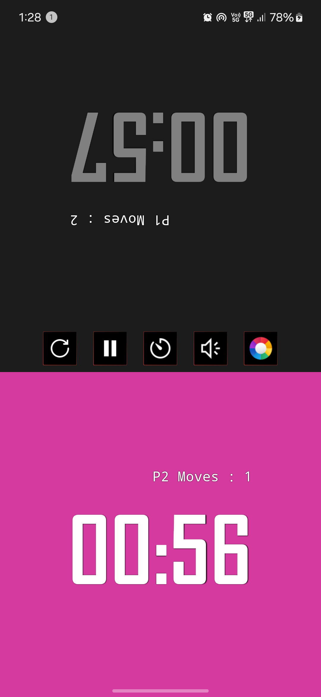
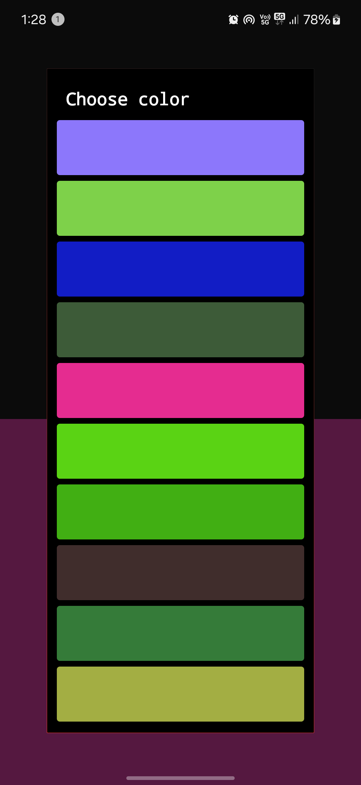
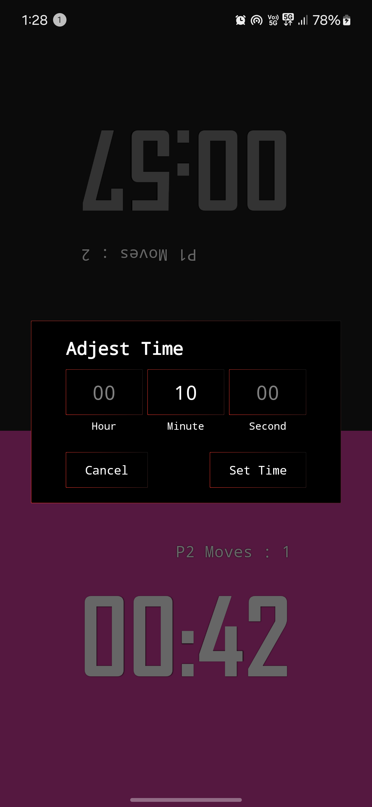

---

# ♟️ Chess Clock - Android App ⏱️

A simple, smooth, and optimized Chess Clock application for Android devices. Control your chess game time easily with custom settings and colors.

---

## 📲 Features
- Set custom time for both players
- Change clock colors as per your choice
- Start, Pause, and Reset the timer
- Clean and minimal interface
- Lightweight, smooth, and battery-friendly
- Works on all Android devices

---

## 🖼️ Screenshots

| 🏠 Home Screen | 🎨 Color Choose | ⏱️ Adjust Time |
|---------------|----------------|----------------|
|  |  |  |

---

## 🚀 How to Use
1. **Home Screen:** Start or reset the chess clock
2. **Color Choose:** Select your preferred clock colors
3. **Adjust Time:** Set the desired time for each player

---

## 🛠️ Built With
- **Language:** Java (Android Studio)
- **Layout:** RelativeLayout (Lightweight)
- **Minimum Android:** API 21 (Lollipop)

---

## 📥 Download APK
👉 [Download Latest Version](https://github.com/harik90/Chess-clock09/ChessClock.apk)

---

## 📌 Permissions
- **Wake Lock:** To keep the screen awake during the game

---

## 👨‍💻 Developer
**Harik Gond**  
[GitHub](https://github.com/harik90)

---

## 📄 License
This project is licensed under the **MIT License**

---

✅ **Ready to Upload on GitHub**  
✅ **Lightweight Design**  
✅ **Professional Look**  

---
